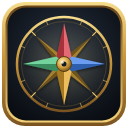

# Stat Compass



## English

Stat Compass is a World of Warcraft Retail addon (Midnight, 12.1). It adds a panel to the equipment page of your character window that compares your secondary stats (Critical Strike, Haste, Mastery and Versatility) with the best European Mythic+ players of your specialization.

### What you see

For each secondary stat the panel shows your own value next to those of the top players: the range where the middle half of them sits, plus their minimum, average and maximum. The stats appear in the same order as in Blizzard's character window.

The comparison group is the 30 best EU players of your specialization in the current Mythic+ season, ranked by their Mythic+ rating in that specialization. If your hero talent tree is common enough among them, Stat Compass compares you with the best players of that hero talent tree instead.

The numbers show how top players distribute their gear. They do not come from a simulation, and Stat Compass cannot tell whether that distribution is the best one for your character.

### Where the data comes from

All data comes from Blizzard's official APIs: the Mythic+ leaderboards of every EU connected realm and the public character profiles of the top players. A weekly job in GitHub Actions collects the data again; releases ship it with the addon. The addon itself never connects to the internet, and it contains no player names.

Blizzard allows its API data to be kept for 30 days, so each dataset expires after 30 days. After that the panel shows only your own values until you install a newer version.

### Installing

Install it from CurseForge or Wago, or unpack the ZIP of a GitHub release so that the folder ends up as `World of Warcraft/_retail_/Interface/AddOns/StatCompass`. If the game is running, type `/reload`.

### Using it

Open your character window and switch to the equipment page; the panel attaches on the right. A minimap button opens the equipment page with a left-click and the addon options with a right-click. There you can pick a skin (Default in WoW style, or Flat dark), show or hide the minimap button, and reset the appearance. Settings are saved per account in `StatCompassDB`.

### For developers

The addon lives in `StatCompass/`. The data pipeline, release tooling and tests are in `tools/` and `tests/`.

```powershell
uv venv --python 3.11 .venv
uv pip install --python .venv/Scripts/python.exe 'lupa==2.6' 'pytest==8.4.2'
.venv/Scripts/python.exe -m pytest -q -p no:cacheprovider
```

- [Data acquisition from Blizzard's APIs](docs/blizzard-acquisition.md)
- [Data contract between data and UI](docs/data-contract.md)
- [Releases and automatic data releases](docs/releasing.md)
- [How agents work in this repository](AGENTS.md)

License terms and attributions are in [LICENSE](LICENSE) and [NOTICE](StatCompass/NOTICE.txt).

## Deutsch

Stat Compass ist ein Addon für World of Warcraft Retail (Midnight, 12.1). Es ergänzt die Ausrüstungsseite deines Charakterfensters um ein Fenster, das deine Sekundärwerte (Kritisch, Tempo, Meisterschaft und Vielseitigkeit) mit den besten europäischen Mythic+-Spielern deiner Spezialisierung vergleicht.

### Was du siehst

Für jeden Sekundärwert zeigt das Fenster deinen eigenen Wert neben denen der Top-Spieler: den Bereich, in dem die mittlere Hälfte von ihnen liegt, dazu ihr Minimum, ihren Durchschnitt und ihr Maximum. Die Werte stehen in derselben Reihenfolge wie in Blizzards Charakterfenster.

Verglichen wird mit den 30 besten EU-Spielern deiner Spezialisierung in der aktuellen Mythic+-Saison, sortiert nach ihrer Mythic+-Wertung in dieser Spezialisierung. Ist dein Heldentalent unter ihnen verbreitet genug, nimmt Stat Compass stattdessen die besten Spieler mit diesem Heldentalent.

Die Zahlen zeigen, wie Top-Spieler ihre Ausrüstung verteilen. Eine Simulation steckt nicht dahinter, und ob diese Verteilung für deinen Charakter die beste ist, kann Stat Compass nicht sagen.

### Woher die Daten kommen

Alle Daten kommen aus Blizzards offiziellen Schnittstellen: den Mythic+-Bestenlisten aller EU-Realmverbünde und den öffentlichen Charakterprofilen der Top-Spieler. Ein wöchentlicher Lauf in GitHub Actions erhebt sie neu, und jeder Release liefert sie mit dem Addon aus. Das Addon selbst geht nie ins Internet und enthält keine Spielernamen.

Blizzard erlaubt, API-Daten 30 Tage aufzubewahren. Deshalb verfällt jeder Datensatz nach 30 Tagen. Danach zeigt das Fenster nur noch deine eigenen Werte, bis du eine neuere Version installierst.

### Installation

Installiere es über CurseForge oder Wago, oder entpacke das ZIP eines GitHub-Releases so, dass der Ordner unter `World of Warcraft/_retail_/Interface/AddOns/StatCompass` liegt. Läuft das Spiel, genügt `/reload`.

### Bedienung

Öffne das Charakterfenster und wechsle auf die Ausrüstungsseite; das Fenster hängt rechts daneben. Ein Minikartensymbol öffnet die Ausrüstung per Linksklick und die Addon-Optionen per Rechtsklick. Dort wählst du das Design (Standard im WoW-Stil oder Flach dunkel), blendest das Minikartensymbol ein oder aus und setzt die Darstellung zurück. Die Einstellungen werden pro Account in `StatCompassDB` gespeichert.

### Für Entwickler

Das Addon liegt in `StatCompass/`, Datenpipeline, Release-Werkzeuge und Tests in `tools/` und `tests/`. Die Befehle zum Testen stehen im englischen Teil. Weitere Dokumentation: [Datenbeschaffung](docs/blizzard-acquisition.md), [Datenvertrag](docs/data-contract.md), [Releases](docs/releasing.md) und [Arbeitsweise der Agenten](AGENTS.md).

Lizenz und Hinweise zu Fremdquellen stehen in [LICENSE](LICENSE) und [NOTICE](StatCompass/NOTICE.txt).
